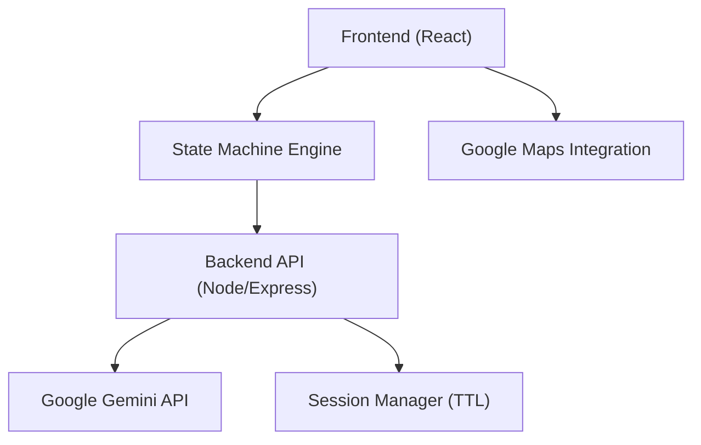

# 🚀 VoteGuide.AI  
**AI-Assisted Civic Guidance Platform for Structured Election Awareness**


> Transforming complex election processes into guided, interactive user journeys using intelligent workflows and Google-powered AI.

---

## 🌐 Overview

VoteGuide.AI is a production-ready, AI-assisted web application designed to simplify election processes through structured, interactive workflows.

---

## 🗂️ Project Structure

```
H2S/
├── server.js
├── server.test.js
├── package.json
├── index.html
├── vite.config.ts
├── vitest.config.ts
├── .env.example
├── public/
└── src/
    ├── main.tsx
    ├── App.tsx
    ├── App.css
    ├── types.ts
    ├── components/
    │   └── ErrorBoundary.tsx
    ├── __tests__/
    │   ├── setup.ts
    │   └── App.test.tsx
    └── assets/
```

---

## 🏗️ Architecture Diagram



---

## ✨ Key Features

- State-machine driven workflow (7 stages)
- AI-powered assistance (Google Gemini)
- Accessibility-first UI (ARIA, keyboard nav)
- Secure input handling + XSS protection
- Performance optimized (lazy loading, TTL cleanup)
- Follows a deterministic state-machine pattern to eliminate invalid user states and ensure workflow integrity

---

## 🧪 Testing

- 38 automated tests (frontend + backend)
- Covers API, UI, accessibility, edge cases

---

## 🔍 Evaluation Mapping

- Code Quality → Modular + typed architecture  
- Security → Sanitisation + CORS + XSS protection  
- Efficiency → Lazy loading + session cleanup  
- Testing → 38 tests across layers  
- Accessibility → ARIA + keyboard + multilingual  
- Google Services → Gemini + Maps + Fonts + Schema  

---

## 🚀 Getting Started

```
npm install
npm run dev
npm test
```

---

## 🛡️ Non-Functional Guarantees

This system is designed with production-grade non-functional considerations:

- **Reliability**: Deterministic state-machine workflow ensures consistent and predictable user progression
- **Scalability**: Extensible architecture with Redis-compatible session storage abstraction
- **Security**: Input sanitisation, rate limiting, and XSS-safe rendering prevent common attack vectors
- **Performance**: Lazy loading and session TTL cleanup minimize memory and bundle overhead
- **Accessibility**: ARIA-compliant components and keyboard navigation ensure inclusive usability
- **Maintainability**: Modular architecture with strong typing and test coverage enables long-term extensibility

---

## 💡 Final Note

This is a **system-level project** designed for real-world deployment, not just a demo.
- API rate limiting (express-rate-limit) applied on `/api` routes to mitigate abuse, brute-force attempts, and denial-of-service (DoS) attacks
